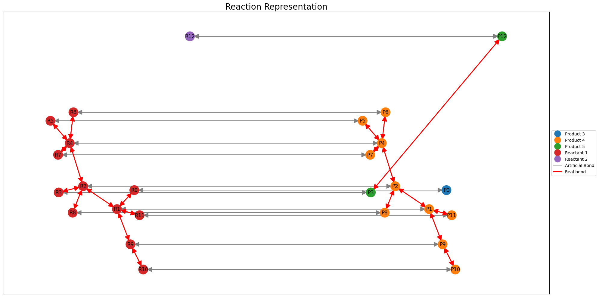
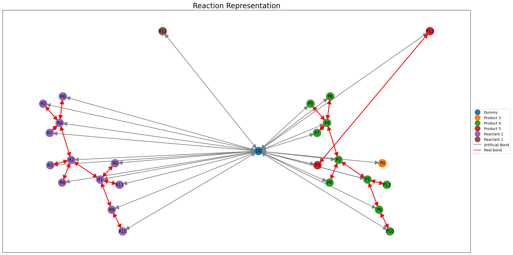

# DeepRxn

DeepRxn software package

## Installation

Clone this repository and change directory:
```
git clone ssh://git@gitlab.tuwien.ac.at:822/e165-03-1_theoretische_materialchemie/deeprxn.git
cd deeprxn
```
We recommend to install the package inside a conda environment (or any other virtual environment of your choice). Follow the pytorch and torch_geometric installation instructions to install for GPUs (here, for CPUs):

For torch scatter and torch sparse, you need might also need to install specific binaries.
```
conda create -n deeprxn python=3.10
conda activate deeprxn
pip install --upgrade pip setuptools wheel
pip install rdkit numpy scikit-learn torch pandas
pip install hydra-core --upgrade
pip install torch_scatter torch_sparse
pip install torch_geometric
pip install wandb
pip install -e .

```

## Data
Put the data in a data folder.

## Test - examples
CGR
```
python scripts/main.py mode=train data=e2 epochs=200 transformation.representation=CGR
```
Connected pair, here connection_direction is important. This variable controls how we connect the pair. Choose 'null' for no connection.
```
python scripts/main.py mode=train data=e2 epochs=200 transformation.representation=connected_pair transformation.connection_direction=bidirectional
```


We can also add dummy nodes. Check out the transformation.yaml for more options.
```
python scripts/main.py mode=train data=e2 epochs=200 transformation.representation=connected_pair transformation.connection_direction=null transformation.dummy_node=global transformation.dummy_connection=bidirectional
```


Let's use attention (check out the code or config files for options). Here we use three attention layers after the message passing. We also access the layers' parameters heads and dropout.
```
python scripts/main.py mode=train data=e2 epochs=200 transformation.representation=connected_pair transformation.connection_direction=null model.attention=reactants_products model.attention_depth=3 model.react_prod_att_cfg.num_heads=6 model.react_prod_att_cfg.dropout=0.1
```

Another example:
```
python scripts/main.py mode=train data=e2 epochs=200 transformation.representation=connected_pair transformation.connection_direction=null model.attention=reactants_products model.use_attention_agg=true model.use_attention_node_update=true
```


## Weights and Biases
Set wandb=True to log the results to Weights and Biases. You need to have an account and set the environment variable WANDB_API_KEY to your API key. One way to do this, is to add the following to your shell script:
```
export WANDB_API_KEY="YOUR KEY HERE"
```

## Configuration with Hydra
- `config.yaml`: Main configuration file
- `data/*.yaml`: Dataset-specific configurations
- `features.yaml`: Featurization settings
- `transformation.yaml`: Data transformation and loading settings
- `model/*.yaml`: Model architecture configurations

https://medium.com/@bezzam/hydra-for-cleaner-python-code-and-better-reproducibility-in-research-c035028101f9 
https://www.kdnuggets.com/2023/03/hydra-configs-deep-learning-experiments.html

## Copyright

Copyright (c) 2024, E. Heid
