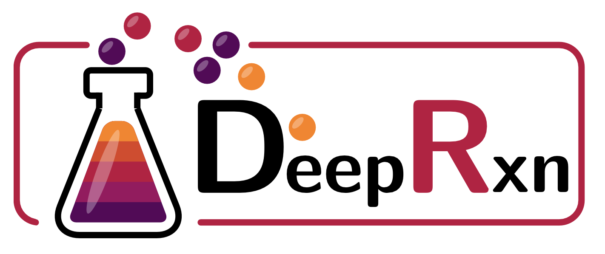

<div align="center">

# DeepRxn

<a href="https://pytorch.org/"></a>
<a href="https://hydra.cc/docs/intro/"></a>




</div>

## Description
DeepRxn package


## Contents
- [Installation](#installation)
- [Data](#data)
- [Code Structure](#code-structure)
- [Hydra](#configuration-with-hydra)

## Installation

Clone this repository and change directory:
```
git clone ssh://git@gitlab.tuwien.ac.at:822/e165-03-1_theoretische_materialchemie/deeprxn.git
cd deeprxn
```
We recommend to install the package inside a Conda environment (or any other virtual environment of your choice).

**Note:** For `torch_scatter`and `torch_sparse`, you need might also need to install specific binaries: 
```
pip install torch-scatter torch-sparse -f https://data.pyg.org/whl/torch-${TORCH}+${CUDA}.html
```
where `${TORCH}` should be replaced by your PyTorch version (e.g., 2.6.0), and `${CUDA}` should be replaced by your CUDA version (e.g., `cpu`, `cu118` or `cu121`).

Here we is an example installation of PyTorch 2.5.1 for CPU. To install for GPUs, follow the PyTorch and `torch_geometric` installation instructions.

```
conda create -n deeprxn python=3.10 && \
conda activate deeprxn && \
pip install rdkit numpy scikit-learn pandas && \
pip install torch==2.5.1 --index-url https://download.pytorch.org/whl/cpu && \
pip install --upgrade hydra-core && \
pip install torch_geometric && \
pip install pyg_lib torch_scatter torch_sparse torch_cluster torch_spline_conv -f https://data.pyg.org/whl/torch-2.5.0+cpu.html && \
pip install wandb && \
pip install -e .
```

## Data
Put the data in a data folder.

## Code Structure
The main idea of the code structure is to have easily exchangeable components which are identified by having their own folders. Each folder has their respective config folder in `conf`. Each component has a base class which has to be followed.

Example data flow:
- `data.py` loads data and returns a dataloader, it uses:
    - `featurizer`: gets/computes features
    - `representation`: the data and features are put in a representation
    - `transform`: transforms data objects by (1) precomputing positional/structural encodings and/or (2) transforming the graph structure (e.g., adding dummy node)

A model follows the following design:
- A `model` defines (1) some model specific code which is not covered by components + (2) its components:
    - `encoder`: Encodes features and possible positional/structural encodings
    - Layers: `mpnn_layer` and/or `att_layer`: backbone of the model
    - `pool`: pooling function
    - `head`: task-specific prediction head
- `act`: activation functions to be used

```
deeprxn/
├── act/                    (activation functions, config in conf/model/)
├── att_layer/              (attention layers, config in conf/model/)
├── encoder/                (encoders, config in conf/model/)
├── featurizer/             (featurizers, config in conf/data/)
├── head/                   (prediction heads, config in conf/model/)
├── model/                  (models, config in conf/model/)
├── mpnn_layer/             (message passing layers, config in conf/model/)
├── pool/                   (pooling functions, config in conf/model/)
├── representation/         (representations, config in conf/data/)
├── transform/              (transformations, config in conf/data/)
├── data.py
├── predict.py
├── train.py
└── utils.py
```

## Configuration with Hydra
In the `conf` folder:
- `*.yaml`: Main config files
- `data/`: Data configs
    - `dataset_cfg/`: Dataset configs
    - `featurizer_cfg/`: Featurizer configs
    - `representation_cfg/`: Representation configs
    - `transform_cfg/`: Transformation configs
    - `*.yaml`: Possible data configs to be passed in the main config
        - E.g., `e2_feat1_cgr_dummy.yaml` could specifiy which dataset, features, representation, and transformation to use.
- `model/`: Model configs
    - `act_cfg/`: Activation function configs
    - `att_layer_cfg/`: Attention layer configs
    - `encoder_cfg/`: Encoder configs
    - `head_cfg/`: Prediction head configs
    - `mpnn_cfg/`: Message passing layer configs
    - `pool_cfg/`: Pooling function configs
    - `*.yaml`: Possible model configs to be passed in the main config
        - E.g., `dmpnn_opt.yaml` could specifiy a model architecture with specific hyperparameters for a regression task

https://medium.com/@bezzam/hydra-for-cleaner-python-code-and-better-reproducibility-in-research-c035028101f9 
https://www.kdnuggets.com/2023/03/hydra-configs-deep-learning-experiments.html


## Weights and Biases
Set wandb=True to log the results to Weights and Biases. You need to have an account and set the environment variable WANDB_API_KEY to your API key. One way to do this, is to add the following to your shell script:
```
export WANDB_API_KEY="YOUR KEY HERE"
```

## Copyright

Copyright (c) 2024, E. Heid
